# Coronary Heart Disease Death Rate Risk-Level Prediction Based On Environmental, Non-Personal Parameters

Project for "CS4641 - Machine Learning" by Team 46: Kinnera Banda, Aditya Kumar, Farouk Marhaba, and Maya Rajan.

## Introduction/Background

Coronary heart disease (CHD), the most common type of heart disease, kills over 300,000 people in the United States annually. It is caused by a buildup of plaque in the arteries that supply blood to the heart, limiting blood flow and increasing the risk of heart attacks. With early preventive measures, actions can be taken to significantly reduce the risk of CHD early on. 

Our project aims to predict the CHD death rate risk for a particular region based on local environmental parameters. The death risk will be classified into a number of bins (such as low, medium, or high risk, etc). From this prediction, we can advise people on CHD death risk based solely on regional data, not personal information, to promote early individual preventative actions. This information can also be used, in the context of local governments, to establish public programs that promote preventative measures towards developing CHD.

## Dataset

Our dataset is from the CDC Division for Heart Disease and Stroke Prevention Interactive Atlas. Each data point contains the features relating to the following topics, for a total of 47 features.

-   Country and State name
-   Coronary Heart Disease death rate per 100,000 for 2016-2018
-   Risk Factors
-   Social Environment
-   Demographics
-   Physical Environment
-   Urban-Rural Status
-   Health Care Delivery and Insurance (e.g. Hospitals and Pharmacies, Insurance, Physicians and Specialists)
-   Health Care Costs: Medical Beneficiaries with Heart Disease

## Methods

### Cleaning Dataset

The values that we pulled from the Interactive Atlas of Heart Disease and Stroke included “-1” values as representatives for Insufficient Data. Primarily, we eliminated all rows in the dataset that featured a -1 value. However, we were left with approximately 13% of the rows we previously had. As a result, we decided to analyze which features had the highest percentage of invalid data. The graph below plots the number of invalid values with the features in our dataset.

   
 

    <b>Figure 1</b>. The number of invalid data points contained within each feature in the dataset.
 

As illustrated, about 6 out of 47 features were contributing the most towards having invalid data points. We decided to eliminate these features as opposed to using the insufficient information as a feature itself because of the type of information they were encoding. For example, one of these features with lots of information gaps included “cr_part_all.” Since this information is relevant to CHD and there are other features that describe cardiac rehabilitation in our dataset (such as “cr_elig_all”), we decided to simplify our dataset and remove such features with more than 1000 invalid values. This resulted in about 82% of the rows being conserved.

### Normalizing Dataset

The features in our cleaned dataset were scattered amongst different scales, which can influence the outcome of our classification algorithms (e.g. skewing distance calculations and cost functions). Also, there were a small number of data points that had CHD death rates 2-3x average values. In an effort to reduce the effect of these outliers on our overall dataset (e.g. skewing cost and optimization functions), we decided to remove 17 data points that had abnormally high target values, which was only 0.64% of our overall dataset . We normalized each feature (and target) to fall within a range of 0.0-1.0. 

 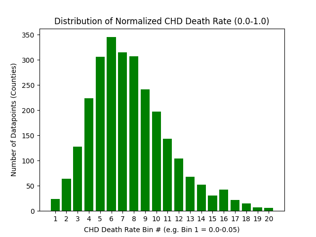  
 

 <b>Figure 2</b>. The distribution of the normalized CHD death rate from our dataset.
 

 

### Picking Risk Classification Bins

Picking risk classification bins is an essential aspect of this project. A risk classification bin groups data points together that have similar CHD death rate (target) values, just like a histogram. Risk bins that correspond to higher target values will be classified as higher-risk data points for our project. For example, a data point falling into the first risk bin can be seen as low-risk for CHD death, whereas a data point falling into the last risk bin can be seen as high-risk for CHD death.

We did not want a simple binary classifier with two bins, since we wanted to learn about multi-class classifiers. We settled on four classification bins: low, low-medium, medium-high, and high risk. As seen in Figure 2, our data point target values were not uniformly distributed. Therefore, when we made the risk-bin intervals have equal spacing (e.g. 0.0-0.25, 0.25-0.50, etc.), there were much more points in the second bin as opposed to the others. We kept this method of creating equally-spaced bins because we wanted to make sure our labels were not subjectively classified as lower/higher risk due to the data points surrounding it. In parts of this report, we discuss some results using 2 risk bins (e.g. 0.0-0.5, 0.5-1.0) or 3 risk bins as well (e.g. 0.0-0.33, 0.33-0.66, etc.).

### Unsupervised Algorithms

We will be using unsupervised clustering algorithms such as K-Means and and GMM with different numbers of clusters to observe relationships between data points, and observe the results. The goal of these clustering algorithms are to maximize the purity of each cluster such that the points within the same cluster correspond to the same risk-level bin. We can evaluate the results by measuring the average purity across all the different clusters.

### Supervised Algorithms

One of the supervised learning techniques we chose to use was Random Forests not only because it is good for unbalanced data, but also because it is able to efficiently handle outliers. Additionally, tuning hyperparameters such as number of estimators, max features used, min samples required to split, min samples required to be a leaf, and max depth allows us to analyze our dataset, such as what portion of features are the most predictive of CHD death rate, which might inform future classification models (i.e. linear regression). We used two techniques to hypertune the Random Forests model: GridSearchCV and RandomizedSearchCV. We searched through a wider range of parameters with RandomizedSearchCV, and based on these results, searched a more narrow range of parameters with GridSearchCV in order to more narrowly fine tune the Random Forests model. We evaluated the results of our RF model by looking at the accuracy score first, and then using a confusion matrix to determine whether features labeled as predictive of high risk did in fact correspond to high risk. We also chose to use the Logistic Regression model along with SMOTE and hypertuning with GridSearchCV using RepeatedStratifiedKFold as the cross-validator because of the presence of unbalanced and lower amount of data in order to prevent bias and also minimizing the variance. For logistic regression, we used both the multinomial and the one-versus-rest model based on which worked best for the specific multiclass classification. Some metrics we used to determine the performance of our models are accuracy, f1-score, precision, recall, and ROC graphs. 

## Results

### Unsupervised Algorithms

When we applied the K-Means algorithm to our normalized dataset, we established that the approximate optimal number of clusters was around 10 using the elbow method.

 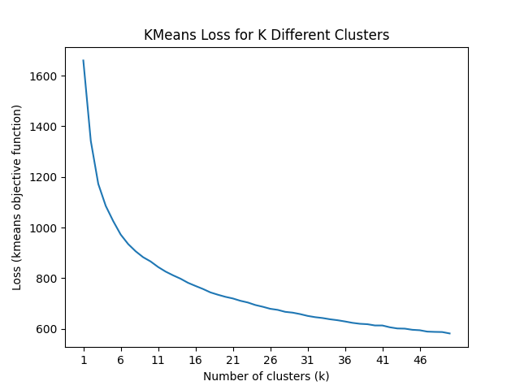  
 

 <b>Figure 3</b>. Graph of K-Means loss when the algorithm is run with different numbers of clusters.
 

After running K-Means with 10 clusters, we calculated the purity as a way to evaluate clustering performance. We found that the average purity for each cluster was 74.9%. 

 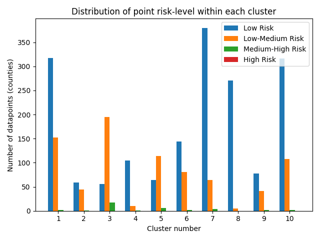  
 

 <b>Figure 4</b>. Bar graph representing distribution of point risk-levels within each cluster.
 

Although the average purity for our crude K-Means clustering was above what we expected, the high purity could be a result of unbalanced data, since it can be easily deduced that the low-risk classification had many more data points than the rest of the bins. Regardless, we ventured off to other algorithms to compare our results, including GMM clustering.

When we applied the GMM algorithm to our normalized dataset, we established that the approximate optimal number of clusters was around 6. To determine this, we used an information-theoretic approach where both the Bayesian Information Criterion (BIC) and Akaike Information Criterion (AIC) were considered.

 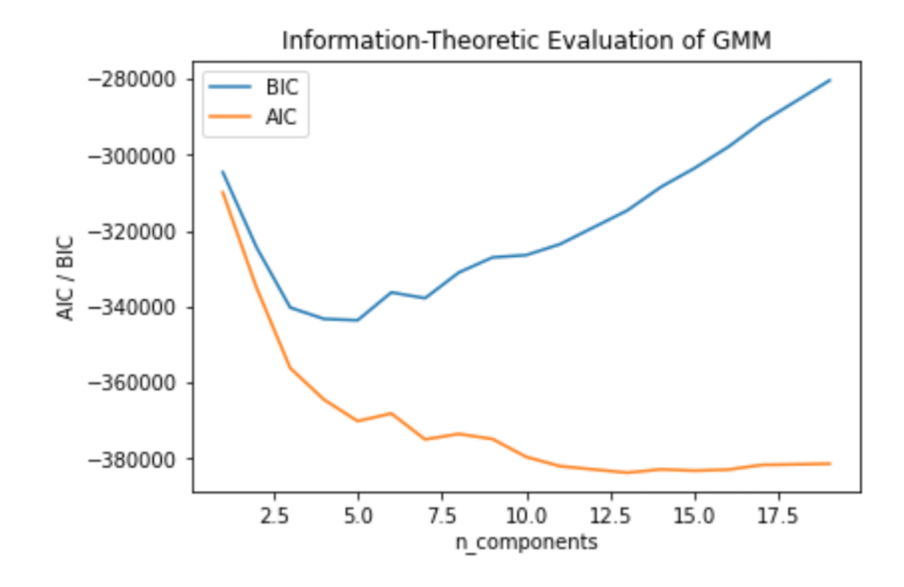  
 

 <b>Figure 5</b>. Graph of AIC and BIC when GMM is run with different numbers of clusters
 

 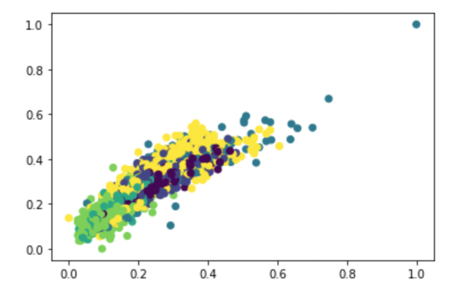  
 

 <b>Figure 6</b>. GMM distribution, running on 6 clusters
 

After running GMM with 6 clusters, we found that the average purity was 97.6%. This purity was hardly improved when removing outliers, which underscores the fact that the chosen number of clusters was enough to accurately model the data and was hence unaffected by the outliers. The goal of running GMM was to examine the resulting clusters and understand the similarities in contained features, especially in comparison with the output of K-Means. We analyzed these comparisons holistically, and concluded that our GMM algorithm clusters our data much more accurately than the hard K-Means clustering. This was expected, as GMM is probabilistic and can therefore capture the variance among our bins better.

### Supervised Algorithms

### Random Forests

In order to tune our Random Forests model, we first had to tune the hyperparameters using RandomizedSearchCV and GridSearchCV. The parameters modified were: max depth, max features, number of estimators used, min samples required to split, and min samples required to be a leaf. The range of parameters we searched through in RandomizedSearchCV was 200 - 2000 for number of estimators, 2 - 40 for the max number of features, 2 - 40 for max depth, 2 - 20 for min number of samples to split, and 1 - 20 for min samples required to be a leaf. The results were:

 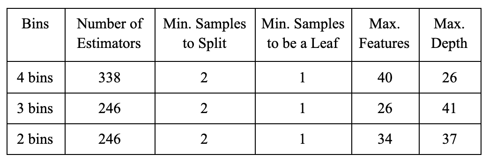  
 

 <b>Figure 7</b>. RandomizedSearchCV results from hyperparameter tuning the RF model.
 

Then, with GridSearchCV, we searched parameters with a radius of +/- 20 with n_estimators, and +/- 1 with max_features, max_depth, min_samples_leaf, and min_samples_split. The final accuracy results were: 4 bins: 0.60, 3 bins: 0.70, 2 bins: 0.81.

Below are the confusion matrices for the 4 bin, 3 bin, and 2 bin scenario respectively after running GridSearchCV.

 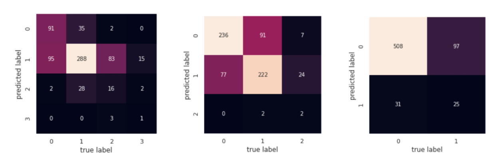  
 

 <b>Figure 8</b>. The confusion matrices of the 4 bin, 3 bin, and 2 bin scenarios of the Random Forests model.
 

The precision, recall, and f1-scores for each bin are depicted below.

 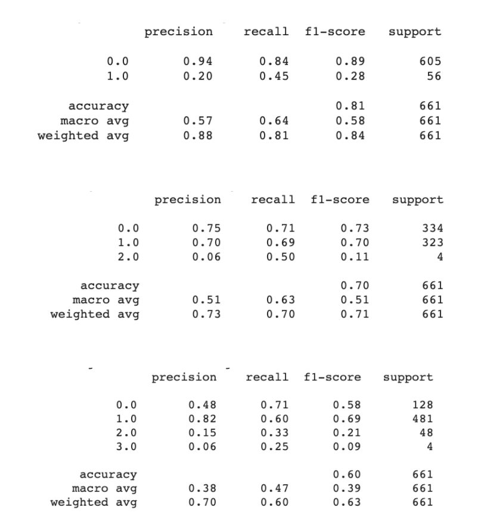  
 

 <b>Figure 9</b>. The Classification Reports for the 2, 3, and 4 bin scenarios (top to bottom).
 

The precision, recall, and f1-scores are much higher for the lower-risk CHD bins. This is likely a result of most of the data being in bins 0 and 1 in the dataset. However, when evaluating the distribution of the dataset, in the 4 bin scenario, 28% of the data was in bin 0 and 53% of the data was in bin 1, and our overall accuracy was 60%. Additionally, in the 3 bin scenario, 48% of the data was in bin 0 and 45% of the data was in bin 1, and our overall accuracy was 70%. Both of these scenarios reflect that our model performed better than guesswork. However, in the 2 bin scenario, about 82% of our data was in bin 0, and our overall accuracy was 81%, implying that our model did not learn over a guess assignment.

### Logistic Regression

When we applied Logistic Regression, we decided to first use SMOTE – Synthetic Minority Oversampling Technique – because of the way we split our data into four bins initially that caused an imbalanced split. We read that the challenge with working with imbalanced datasets is that most machine learning techniques will give poor performance results on the minority class. After oversampling, the length of our data was 3036. On performing Logistic regression after oversampling, our accuracies for 2, 3, and 4 bins were 78%, 59%, and 47% respectively. 

 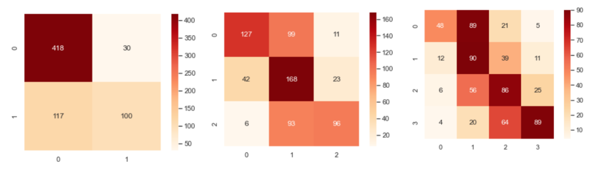  
 

 <b>Figure 10</b>. Confusion matrices for 2, 3, and 4 bins respectively after oversampling with SMOTE.
 

We then decided to perform hyperparameter testing on the original dataset and not the oversampled one. We did this using GridSearchCV which is a brute force way of looking for the best accuracy parameters. The parameter grid we used are as follows:

   
 

 <b>Figure 11</b>. Hyperparameter ranges used in GridSearchCV for Logistic Regression.
 

The cross-validation generator we used in our GridSearchCV was RepeatedStratifiedKFold(). This method would significantly reduce the bias by using the maximum volume of data for training and fitting. It would also help with reducing the variance. The best fit parameters for 2, 3, and 4 bins split was {'C': 1.0, 'penalty': 'l2', 'solver': 'lbfgs'}, and had 84%, 60%, and 51% respectively.

 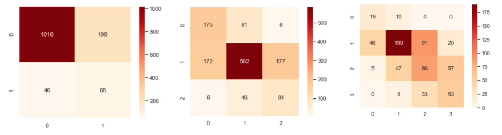  
 

 <b>Figure 12</b>. Confusion Matrices for 2, 3, and 4 bins respectively after Hyperparameter tuning.
 

Next, we wanted to investigate which Logistic Regression model for multi-class prediction would work the best. We tested both the one-versus-rest and the multinomial model. For the 2-bin and the 4-bin classification, the multinomial model performed better and for 3-bin classification the one-versus-rest model performed better. 

   
 

 <b>Figure 13</b>. Multinomial vs. one-vs-rest model accuracies.
 

 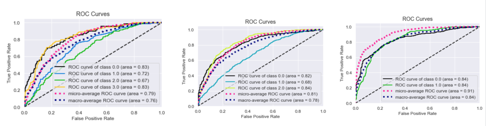  
 

 <b>Figure 14</b>. ROC curves for 4, 3, and 2 bins respectively. Each run with the best model from Figure 12.
 

We plotted ROC curves for each of the 3 multiclass classification. We observed that for 4-bin classification, the model performed much better in classifying class 0, for 3-bin classification, the model performed better for classifying class 2 and for 2-bin classification, the model performed equally in classifying data points under class 0 and class 1. 

 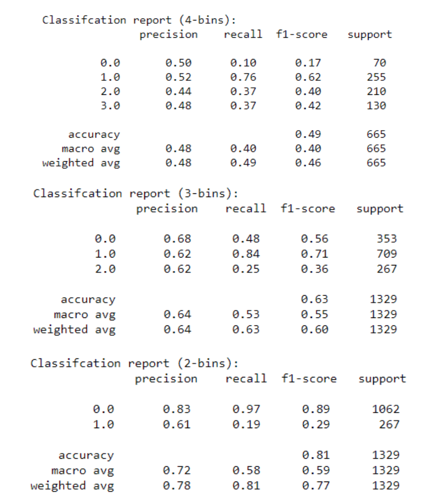  
 

 <b>Figure 15</b>. Classification Reports for 4, 3, and 2 bins (top to bottom).
 

On generating classification reports after hypertuning parameters for Logistic Regression, Figure 16 explains the results. We noticed that the precision is highest for class 0 and class 1 in the binary classification scenario, which indicates that 83% and 61% elements from true and false positives were true positives. Recall is also highest for binary classification, which says that 97% of the elements from false negatives were determined as true positives indicating that our model did indeed learn over the guess assignment. Precision and recall is lowest for 4-bin classification and way below our guess assignment which indicates that our model performed lower than the guesswork. The lowest recall for class 0 assignment (in the 4-bin classification) is 10% which means that 10% of false negatives were identified as true positives. Therefore, the 4-bin and 3-bin classification models did not learn much over the guesswork, but the 2-bin classification on the other hand did.

## Discussion

Because we have 41 features in our dataset, we were hoping to reduce our column size by selecting components that best represent the overall data. We then wanted to run this reduced-column dataset through our K-means and GMM algorithms. Our initial idea was to use Principal Component Analysis (PCA) to identify these “most important” data points. We believed that because PCA returns an orthogonal set of vectors that portray the directions along which we find maximum variance, we could ascribe “importance” to this output. However, analysis showed us that our assumption was incorrect, as PCA better tells us “importance” as features with higher magnitudes of difference rather than explanatory ability of data. We looked into Latent Dirichlet Allocation as an alternative, but realized that because it helps project target variables into another dimension, it falls more into supervised learning and would not help us with K-means or GMM. Instead, we decided to maintain the size of our dataset as, even if feature columns are highly covariated predictors of the same target, keeping such “extra” columns would not hurt our analysis. We were surprised with the average purity of our clusters, 74.9% for K-Means and 97.6% for GMM. However, next steps for the unsupervised algorithms used in this project would be finding ways to analyze the clusters using other clustering algorithms, such as DBSCAN. In doing so, we will try to mitigate the issue of having an unbalanced number of data points across the range of target values. 

Some next steps that might be taken to improve the accuracy results of the Random Forests model are running more iterations (>100) of RandomizedSearchCV and/or searching with a wider range of values in order to better tune the hyperparameters. Additionally, because the f1-score was low for the higher-risk bins, it would be beneficial to acquire more training data from previous years of the Interactive Atlas in order to prevent the model from placing everything in one bin; this effect can be seen in the confusion matrices in Figure 8, as particularly in the 2 bin scenario, most of the data points got placed in bin 0, and the model did not perform better than guesswork. Overall, the 3-bin RF model improved the most from baseline performance, likely because the data was more evenly spread between bins 0 and 1, implying that acquiring data with a wider distribution might lead to better results. Ideally, we would have gotten higher accuracy scores in the RF model, especially with 4 bins (our original accuracy target for supervised algorithms was 0.90); however, given the size and spread of our dataset, this was not possible. Possible next steps for Logistic Regression, on the other hand, to improve classification accuracy, especially for the 4-bin classification is to use Recursive Feature Elimination since PCA did not seem to have much of an affect on improving our accuracy. The low precision and recall scores could be due to the fact there are lower number of training samples and so because of this, along with collecting more data, we could also couple two or more base estimators, for example, Random Forests with Logistic Regression (using ensemble methods) could prove to be helpful in improving the accuracy as well the area under the ROC curves. 

Overall, this project was a very insightful way to predict the CHD death risk levels of particular regions around the United States. Since we were able to successfully classify the CHD death risk level using environmental characteristics, our project can be applied to local and statewide legislation of regions suffering from high CHD death. For example, they could promote investments and budget allocation in preventative healthcare, with hopes of decreasing the CHD death rate over time. By using our quantitative and algorithmic approach, we are hoping that regional governments suffering from high CHD death can view these potential investments and budget allocations from a non-partisan perspective, and thus focus their energy on delivering crucial preventative healthcare to their constituents. 

## References

Dalen, James et. al. “The Epidemic of the 20th Century: Coronary Heart Disease.” The American Journal of Medicine, 2014. Retrieved 25 September 2020 from https://www.amjmed.com/article/S0002-9343(14)00354-4/pdf

“Coronary Artery Disease: Prevention, Treatment and Research.” Johns Hopkins Medicine. Retrieved 25 September 2020 from https://www.hopkinsmedicine.org/health/conditions-and-diseases/coronary-artery-disease-prevention-treatment-and-research

“Heart Disease Facts.” Centers for Disease Control and Prevention, 2020. Retrieved 25 September 2020 from https://www.cdc.gov/heartdisease/facts.htm
