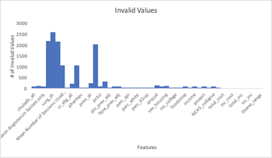

# Coronary Heart Disease Death Rate Risk-Level Prediction Based On Environmental, Non-Personal Parameters

Project for "CS4641 - Machine Learning" by Team 46: Aditya Kumar, Farouk Marhaba, Kinnera Banda, and Maya Rajan.

## Introduction/Background

Coronary heart disease (CHD), the most common type of heart disease, kills over 300,000 people in the United States annually. It is caused by a buildup of plaque in the arteries that supply blood to the heart, limiting blood flow and increasing the risk of heart attacks. With early preventive measures, actions can be taken to significantly reduce the risk of CHD early on.

Our project aims to predict the CHD death rate risk for a particular region based on local environmental parameters. The death risk will be classified into several bins (such as low, medium, or high risk, etc). From this prediction, we can advise people on CHD death risk based solely on regional data, not personal information, to promote early individual preventative actions. This information can also be used, in the context of local governments, to establish public programs that promote preventative measures towards developing CHD.

## Dataset

Our dataset is from the CDC Division for Heart Disease and Stroke Prevention Interactive Atlas. Each data point contains the features relating to the following topics, for a total of 47 features.

-   Country and State name
-   Coronary Heart Disease death rate per 100,000 for 2016-2018
-   Risk Factors
-   Social Environment
-   Demographics
-   Physical Environment
-   Urban-Rural Status
-   Health Care Delivery and Insurance (e.g. Hospitals and Pharmacies, Insurance, Physicians and Specialists)
-   Health Care Costs: Medical Beneficiaries with Heart Disease

We chose to forego other features like the number of neurosurgeons, neuro specialists, air quality, and three others because of the large number of NaN values. In this regard, since we are trying to classify CHD risk, our ground truth variable for our supervised learning algorithms would be the CHD death rate placed into our predetermined risk bins.

### Cleaning Dataset

The values that we pulled from the Interactive Atlas of Heart Disease and Stroke included “-1” values as representatives for Insufficient Data. Primarily, we eliminated all rows in the dataset that featured a -1. However, we were left with approximately 13% (1/8th) of the rows we previously had. As a result, we decided to analyze which features had the highest percentage of invalid data. The graph below plots the number of invalid values with the features in our dataset.

   
 

    <b>Figure 1</b>. The number of invalid data points contained within each feature in the dataset.
 

As illustrated, about 6 out of 47 features were contributing the most; we decided to eliminate all features that had more than 1000 invalid values. This resulted in about 82% of the rows being conserved.

### Normalizing Dataset

The features in our cleaned dataset were scattered amongst different scales, which can influence the outcome of our classification algorithms (by skewing distance calculations, for example). We normalized each feature (and target) to fall within a range of 0.0-1.0.

   
 

 <b>Figure 2</b>. The distribution of the normalized CHD death rate from our dataset.
 

## Methods

### Picking Risk Classification Bins

Picking risk classification bins is an essential aspect of this project. We did not want a simple binary classifier with two bins, since we wanted to learn about multi-class classifiers. We settled on four classification bins: low, low-medium, medium-high, and high risk. Since our target value was not uniformly distributed, we could not split the target value range into 4 equally-spaced bins as most data points would fall within the same one or two bins. Rather, we decided to make the bins have an equal number of points. However, we are still looking into other ways to create these risk intervals.

   
 

 <b>Figure 3</b>. The range of normalized CHD death rates for each risk classification bin.
 

### Unsupervised Algorithms

We will be using unsupervised clustering algorithms such as K-Means and GMM with different numbers of clusters to observe relationships between data points and observe the results. The goal of these clustering algorithms would be to maximize the purity of each cluster such that the points within the same cluster correspond to the same risk-level bin. We can evaluate the results by measuring the average purity across all the different clusters.

### Supervised Algorithms

We plan to use supervised algorithms such as Random Forests to identify important features. By using RF, we can locate the most predictive features in our dataset, which will inform our linear regression design. We can evaluate the results of RF by looking at an accuracy score first, and then using a confusion matrix to determine whether features labeled as predictive of high risk did correspond to high risk. We will use Linear Regression to help predict CHD death rates by region based on the specified input. We might modify the Linear Regression algorithm slightly by changing the evaluation metric to categorize results into our four risk-levels. We can then measure the accuracy of these bins based on the modified regression. Lastly, we believe supervised Hidden Markov Models will help look at the evolution of events from 2005 to 2018 and predicting metrics in 2019-20. To evaluate our Hidden Markov Model, we will compute the likelihood of different sequences of events using our test data, and we will use the forward algorithm to compute the mean error by tracking the state of the HMM and the expected observation at some future time. Additionally, we will partition our dataset into training (80%), validating(10%), and testing (10%) subsets to ensure we have ground-truth data to base our evaluations on. We will run these algorithms multiple times with randomized partitioned data points to prevent overfitting.

## Results

### Unsupervised Algorithms

When we applied the K-Means algorithm to our normalized dataset, we established that the approximate optimal number of clusters was around 6 using the elbow method.

   
 

 <b>Figure 4</b>. Graph of K-Means loss when the algorithm is run with different numbers of clusters.
 

After running K-Means with 6 clusters, we measured the purity as a way to measure clustering performance. We found that the average purity for each cluster was 41.8%.

   
 

 <b>Figure 5</b>. Bar graph representing the distribution of point risk-levels within each cluster.
 

Although seemingly low average purity, this value is still higher than the theoretical 25% average purity if the clusters were randomly assigned. With the K-Means results in hand, we transitioned to GMM to observe and compare clustering results.

When we applied the GMM algorithm to our normalized dataset, we established (interestingly enough) that the approximate optimal number of clusters was around 6. To determine this, we used an information-theoretic approach where both the Bayesian Information Criterion (BIC) and Akaike Information Criterion (AIC) were considered.

   
 

 <b>Figure 6</b>. Graph of AIC and BIC when GMM is run with different numbers of clusters
 

   
 

 <b>Figure 7</b>. GMM distribution, running on 6 clusters
 

After running GMM with 6 clusters, we found that the average purity was 97.6%. The goal of running GMM was to examine the resulting clusters and understand the similarities in contained features, especially in comparison with the output of K-Means. We are still analyzing these comparisons holistically, but it seems that the GMM algorithm clusters our data much more accurately than the hard K-Means clustering.

### Supervised Algorithms

We currently do not have results for using supervised algorithms on our dataset.

## Discussion

Because we have 41 features in our dataset, we were hoping to reduce our column size by selecting components that best represent the overall data. We then wanted to run this reduced-column dataset through our K-means and GMM algorithms. Our initial idea was to use Principal Component Analysis (PCA) to identify these “most important” data points. We believed that because PCA returns an orthogonal set of vectors that portray the directions along which we find the maximum variance, we could ascribe “importance” to this output. However, the analysis showed us that our assumption was incorrect, as PCA better tells us “importance” as features with higher magnitudes of difference rather than the explanatory ability of data. We looked into Latent Dirichlet Allocation as an alternative but realized that because it helps project target variables into another dimension, it falls more into supervised learning and would not help us with K-means or GMM. Instead, we decided to maintain the size of our dataset as, even if feature columns are highly covariate predictors of the same target, keeping such “extra” columns would not hurt our analysis.

We are also working on supervised algorithms currently. The goal of all our analyses is to understand the common predictors behind CHD and, given new data, correctly predict risk levels. Thus our next steps are to finish writing our supervised algorithms and compare our results into a cohesive output.

## References

Dalen, James et. al. “The Epidemic of the 20th Century: Coronary Heart Disease.” The American Journal of Medicine, 2014. Retrieved 25 September 2020 from https://www.amjmed.com/article/S0002-9343(14)00354-4/pdf

“Coronary Artery Disease: Prevention, Treatment and Research.” Johns Hopkins Medicine. Retrieved 25 September 2020 from https://www.hopkinsmedicine.org/health/conditions-and-diseases/coronary-artery-disease-prevention-treatment-and-research

“Heart Disease Facts.” Centers for Disease Control and Prevention, 2020. Retrieved 25 September 2020 from https://www.cdc.gov/heartdisease/facts.htm